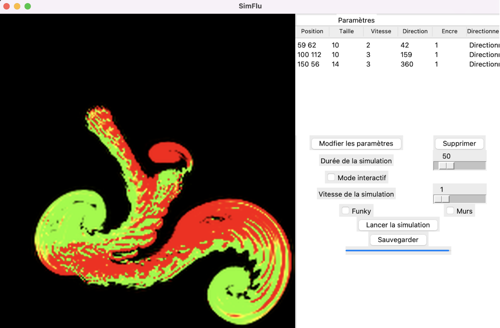

# SimFlu
Python based app for fluid simulation.

## Description

Cette application permet d’illustrer divers phénomènes liés aux fluides. À visée éducative, elle se destine à des étudiants niveau collège/lycée. Elle permet entre autre de facilitier la compréhension de concepts physiques et observer la validité de la théorie.

Elle se décompose en trois parties:

**1) Simulations de gaz parfaits**
- Modèle du gaz parfait, collisions élastiques
- Vérification de la théorie (distribution de vitesse de Maxwell-Boltzmann)
- Différents cas (distribution uniforme vitesse, mélange de deux gaz)
- Calcul de pression


**2) Simulation de liquides**
- Calcul de densité de particules
- Implémentation de la méthode SPH


**3) Simulation d'un fluide incompressible**
- Multiples choix de paramètres: type de source, positions, vitesses, etc...
- Basé sur les équations de Navier-Stokes




# Comment utiliser

- Installer les modules suivants :  date, datetime, matplotlib, numpy, openCV, PIL, pytest, scipy, tkinter
  ```pip install date, datetime, matplotlib, numpy, openCV, PIL, pytest, scipy, tkinter```
- Lancer le fichier app.py
  ```python3 app.py```
- Suivre les instructions du menu aide pour naviguer dans l'application.

# L'équipe
AUDEBERT Erwann, BERODY Evan, DIP BISTA Samip, KALLA Mehdi, ROBERT LAMBRECHT Victor, SALINAS Julia


# Sources
- https://github.com/rafael-fuente/Ideal-Gas-Simulation-To-Verify-Maxwell-Boltzmann-distribution/tree/master
- https://github.com/AlexandreSajus/Python-Fluid-Simulation/tree/master/src/pythonsph
- https://github.com/Ceyron/machine-learning-and-simulation
- https://github.com/GregTJ/stable-fluids
- https://www.researchgate.net/publication/2560062_Real-Time_Fluid_Dynamics_for_Games
